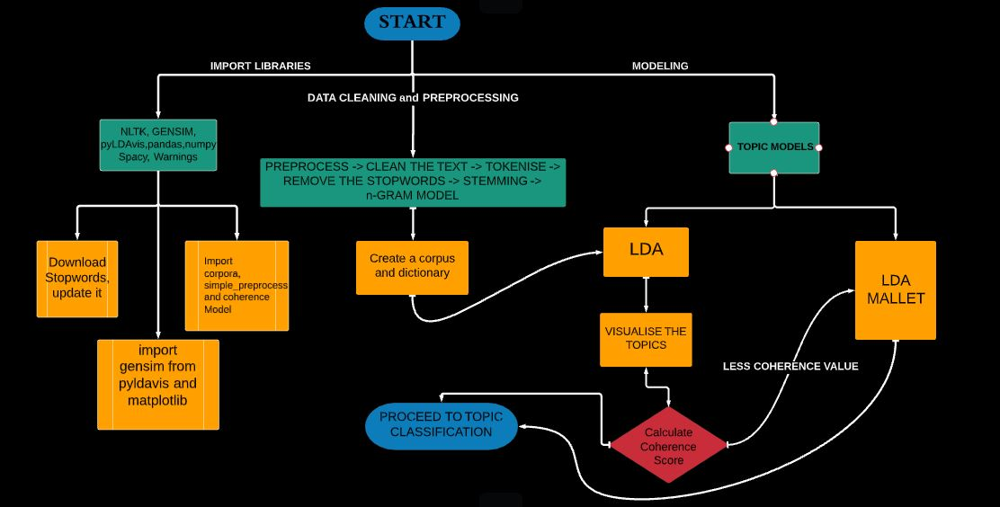

# Topic Modeling

Topic modeling is a type of statistical modeling for discovering the abstract “topics” that occur in a collection of documents.
This script performs *Topic Modeling* using algorithms mentioned below. Further more, other algorithms like LSA, PSLA, lda2vec can also be implemented

## Algorithms used
* Latent Dirichlet Allocation(LDA)
* LDA Mallet Model - a Toolkit 

> To use LDA Mallet Model, download the zip file from : http://mallet.cs.umass.edu/download.php. 
> Once installed and unzipped, set the environment variable %MALLET_HOME% to the point to the MALLET

## Libraries Needed
1. gensim
2. mltk
3. spacy
4. pyLDAvis
5. matplotlib
6. numpy, pandas
7. pickle

## Pipeline

## Walkthrough
- Import the Libraries
- Discover the Dataset
- Clean the dataset
- Preprocess : 
  - Tokenise
  - Build Bigram and Trigram Models
  - Remove stopwords and Lemmatize
  - Create Dictionary and corpus
- Topic Modelling 
  - LDA
  - Visualise the Topics discovered
  - LDA Mallet if your Coherence Value is < 0.5

## Resources to delve more
1. Topic Modelling : https://monkeylearn.com/blog/introduction-to-topic-modeling/
2. Algorithms : https://medium.com/nanonets/topic-modeling-with-lsa-psla-lda-and-lda2vec-555ff65b0b05

# Topic Classification
Topic classification is a ‘supervised’ machine learning technique, one that needs training before being able to automatically analyze texts. 

## Algorithms used
1. Naive Bayes
2. SGD
3. Logistic Regression
4. XG Boost Classifier

